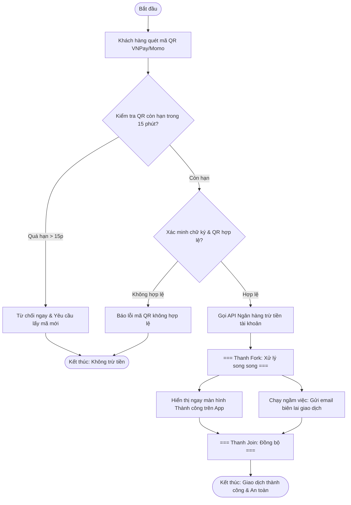

# BÁO CÁO PHÂN TÍCH LỖI LOGIC QUY TRÌNH THANH TOÁN VNPAY VÀ THIẾT KẾ ACTIVITY DIAGRAM

> 👤 **Học viên:** Đỗ Hoàng Sơn | **Mã SV:** PTIT-HCM-066
> 🏫 **Môn học:** IT105-K25-Phan-tich-thi-t-k-h-th-ng

---

## 📊 Sơ đồ thiết kế hệ thống (Activity Diagram)

> 💡 *Sơ đồ dưới đây được render tự động trực tiếp trên GitHub bằng Mermaid. Bạn cũng có thể tải file **`bt3.drawio`** trong repository này để mở và chỉnh sửa trực tiếp trên [Draw.io (diagrams.net)](https://app.diagrams.net).* 

---

## Nhiệm vụ 1: Phân tích lỗi sai AS-IS và Quy tắc nghiệp vụ

Sau khi xem xét bản phác thảo quy trình thanh toán QR hiện tại của BA, mình nhận thấy có 2 lỗi logic cực kỳ nghiêm trọng về mặt bảo mật tài chính và trải nghiệm người dùng (UX):

Thứ nhất là lỗi thứ tự trừ tiền. BA đang thiết kế hệ thống gọi API trừ tiền của khách hàng ngay trước khi kiểm tra tính hợp lệ của mã QR. Đây là lỗ hổng chết người vì nếu mã QR giả mạo, hết hạn hoặc bị lỗi, tài khoản của khách hàng vẫn bị trừ tiền oan uổng trước khi hệ thống kịp nhận ra vấn đề.

Thứ hai là lỗi xử lý tuần tự khi gửi email. Sơ đồ hiện tại bắt khách hàng phải chờ hệ thống thực hiện xong việc gửi email biên lai rồi mới chịu hiển thị thông báo thành công lên màn hình điện thoại. Việc này làm tăng độ trễ mạng không cần thiết, gây ức chế cho người dùng khi phải nhìn màn hình quay vòng tròn chờ đợi tác vụ gửi mail vốn chỉ nên chạy ngầm.

- Quy tắc 1 (Trừ tiền an toàn): Hệ thống chỉ được phép gọi API trừ tiền KHI VÀ CHỈ KHI đã xác minh mã QR hoàn toàn hợp lệ.
- Quy tắc 2 (Xử lý song song): Tối ưu UX bằng cách tách luồng sau khi trừ tiền thành 2 nhánh chạy đồng thời: hiển thị ngay giao diện thành công trên App và chạy ngầm việc gửi email.
- Bẫy dữ liệu (Edge Cases): Kiểm tra thời hạn mã QR nghiêm ngặt trong 15 phút. Nếu quá hạn, từ chối ngay lập tức và yêu cầu lấy mã mới, tuyệt đối không cho phép trừ tiền.

## Nhiệm vụ 2: Thiết kế sơ đồ Activity Diagram TO-BE

Để khắc phục triệt để các lỗi logic trên, mình đã xây dựng lại sơ đồ Activity Diagram theo chuẩn UML TO-BE. Sơ đồ áp dụng cấu trúc rẽ nhánh Decision (hình thoi) để kiểm tra các bẫy dữ liệu về thời gian hết hạn và tính hợp lệ của mã QR.

Đồng thời, sơ đồ sử dụng cặp thanh Fork/Join để phân tách luồng sau khi trừ tiền thành công thành hai tác vụ chạy song song, đảm bảo hiệu năng hệ thống và trải nghiệm mượt mà nhất cho khách hàng.

| Bước | Tác nhân / Thực thể | Hành động chi tiết | Điều kiện rẽ nhánh / Kết quả |
| --- | --- | --- | --- |
| 1 | Khách hàng | Quét mã QR thanh toán VNPay/Momo trên ứng dụng | Nhận thông tin payload từ mã QR |
| 2 | Hệ thống | Kiểm tra thời hạn hiệu lực của mã QR (so với mốc 15 phút) | Nếu quá hạn: Từ chối ngay, yêu cầu tạo mã mới, dừng giao dịch |
| 3 | Hệ thống | Xác thực chữ ký số và tính toàn vẹn của mã QR | Nếu không hợp lệ: Thông báo lỗi QR, dừng giao dịch |
| 4 | Hệ thống | Gọi API kết nối ngân hàng để thực hiện trừ tiền | Chỉ thực hiện khi QR hợp lệ và còn hạn |
| 5 | Thanh Fork | Kích hoạt đồng thời 2 luồng xử lý độc lập | Tối ưu hóa thời gian phản hồi cho người dùng |
| 6a | Hệ thống (Nhánh 1) | Hiển thị ngay màn hình 'Thanh toán thành công' trên App | Khách hàng nhận phản hồi tức thì |
| 6b | Hệ thống (Nhánh 2) | Thực thi tác vụ nền gửi email biên lai giao dịch | Không làm nghẽn luồng giao diện chính |
| 7 | Thanh Join | Đồng bộ hóa hoàn tất cả 2 luồng xử lý song song | Kết thúc quy trình giao dịch an toàn tuyệt đối |

## Nhiệm vụ 3: Đánh giá thiết kế và Hướng dẫn nộp bài GitHub

Sơ đồ Activity Diagram TO-BE được thiết kế hoàn toàn bám sát các quy tắc nghiệp vụ khắt khe của cổng thanh toán điện tử, đặt sự an toàn tài chính của khách hàng lên hàng đầu và tối ưu hóa tốc độ xử lý.

Mình đã xuất toàn bộ sơ đồ thành mã nguồn Mermaid tích hợp trực tiếp trong báo cáo này để GitHub tự động render, đồng thời cấu trúc dữ liệu node/edge sẵn sàng để đồng bộ hóa thành file Draw.io phục vụ việc nộp bài lên repository 'IT105-K25-Phan-tich-thi-t-k-h-th-ng'.

---

## 📁 Danh sách tệp tin nộp bài trong Repository
- 📝 `bt3.docx`: Báo cáo tài liệu phân tích nghiệp vụ hoàn chỉnh.
- 🎨 `bt3.drawio`: File thiết kế sơ đồ chuẩn theo quy định đề bài (mở trực tiếp bằng [Draw.io](https://app.diagrams.net) hoặc Lucidchart).
